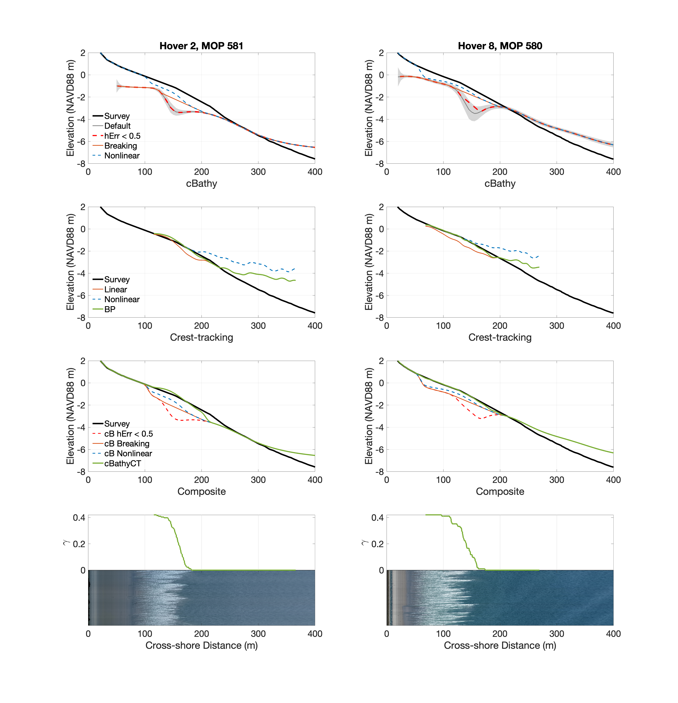

## Lange, Athina M.Z., Fiedler, Julia W., Merrifield, Mark A., Guza, R.T. (2022)
## UAV video-based estimates of nearshore bathymetry, submitted to Coastal Engineering

Nearshore bathymetry estimated from video acquired by a hovering UAV is compared with ground truth. Individual wave crests (distinguished from the breaking wave toe that can move down the wave front face) in video timestacks are determined with a deep-learning neural network and surfzone depth estimates are computed from the wave celerity. Time-2D spatial transforms (cBathy) are used to estimate wave phase speed and depth between the surfzone and 10m depth. Composite profiles (cBathyCT), formed by joining cBathy and crest-tracking solutions near the surfzone seaward edge, based on a newly determined gamma(x) parameter, avoid the large cBathy errors associated with the onset of breaking. Incident wave heights were relatively constant on each day, but varied over days between 0.55-2.15m.  Averaged over all 17-min hovers and cross-shore transects (130 total), surfzone depths errors were relatively small (average root-mean-square error < RMSE > = 0.24m, < Bias > = -0.02m) after including a nonlinear correction to the linear phase speed. Between the seaward surfzone edge and 10m depth, errors are similar to previous cBathy studies: < RMSE > = 0.96m, < Bias > = 0.61m with the largest errors in deepest water. Beach profiles were generally similar for all 8 test days, concave up with a slight terrace (no sandbar) and small alongshore depth variations. Accuracy was lower on one transect with a shallow reef. 

##
This code is the companion to 'UAV video-based estimates of nearshore bathymetry'. 
The code is set up to be self-contained once everything is downloaded/installed, and provides a number of example timestacks to run through the method. 
Any questions or suggestions can be emailed to Athina Lange (alange@ucsd.edu).

Everything can be run from bathy_from_UAV.m

## Installation:
  - current GitHub repository
    - unzip all folders
  - Timestack images from GoogleDrive: <https://tinyurl.com/timestack>
  - Curve Fitting MATLAB toolbox
  - Image Processing Toolbox MATLAB toolbox
  - WaveCrestDetection GitHub to predict wave crests from new timestacks (<https://github.com/AthinaLange/WaveCrestDetection>)

## Input
  - ground-truth survey (minimum: subaerial survey - requires commenting out error calculations in bathy_inversion.m)
  - cBathy results from same hovers (see bathy_from_UAV.m for input format)
  - timestack images at (0.1m, 0.1s) resolution (anything else requires retraining neural network)
    - WaveCrestDetection neural network is currently run with Python through the terminal and is not part of bathy_from_UAV.m)
    
## Output
Video_bathy (structure)
  - date - YYYYMMDD
  - location - ie. 'Torrey' (pulled from timestack name)
  - flight - flight number
  - mop - mop number
  - x10 - [0:0.1:500]m
  - survey - z - Depth pulled from survey on MOP line
  - cbathy -
    - z - cBathy direct output on given transect
    - zerr - cBathy hErr 
    - cbathy_hErr - cBathy with hErr > 0.5m region interpolated over
    - cbathy_gamma - cBathy with breaking region removed for given variable gamma(x)
  - tide - tide level (pulled from cbathy)
  - crests - 
    - t - time for wave tracks (sec)
    - x - cross-shore location for wave tracks (m) (0 is offshore, 500 is onshore)
    - c - phase speed of wave tracks - interp to x10
  - bp - breakpoint index of wave tracks
  - xshift - cross-shore shift index to match subaerial survey with subaqueous bathymetry
  - h_avg - interped to x10
    - lin - linear crest-tracking c = sqrt(gh)
    - nlin - nonlinear crest-tracking c = sqrt(gh(1+0.42))
    - bp - breakpoint transition crest-tracking c = sqrt(gh(1+gamma(x)))
  - gamma - transition between 0 and 0.42 for wave tracks (interped to x10)
  - gamma_mean - gamma(x) - mean of step function gamma for wave tracks
  - composite - constructed bathymetry with subaerial survey with ...
    - cbathy_hErr - cBathy with hErr < 0.5m 
    - cbathy_gamma - cBathy with breaking region removed
    - cbathy_nlin - cBathy_gamma with gamma(x) correction
    - cbathyCT - breakpoint transition crest-tracking surfzone bathymetry and cBathy offshore
  - lims - index of [1st BP valid onshore point, onshore cutoff of breaking, offshore cutoff of breaking]
  - Error - 
    - RMSE - root-mean-square error
    - Skill - skill of estimated versus observed survey bathymetry
    - Bias - bias of estimated bathymetry

    - insz - inner surfzone (between shoreline and end of active wave breaking - gamma(x)=0.42)
    - break - breaking region (active wave breaking region - where gamma changes)
    - sz - full surfzone region (between shoreline and wave breaking region)
    - full - [0 500] region
    - offshore - offshore region (between beginning of wave breaking and 500m - gamma(x) = 0)
           
    - cb - default cBathy (no region removed)
    - cb_hErr - cBathy with hErr > 0.5m removed     
    - cb_gamma - cBathy with breaking region removed
    - lin - linear crest-tracking
    - nlin - nonlinear crest-tracking
    - bp - breakpoint transition crest-tracking
    - comp_hErr - composite cBathy_hErr
    - comp_gamma - composite cBathy_gamma
    - comp_nlin - composite cBathy_nlin
    - comp_CT - composite BP + cBathy

## Results
Breakpoint Detector Example

- Blue dot: Unbroken, dot at end of track
- Green dot: Breakpoint location along wave track
- Red dot: Entire wave track broken, dot at beginning of track
       
Example of two hovers

